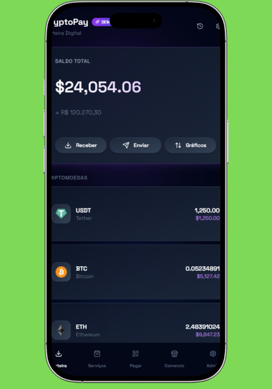
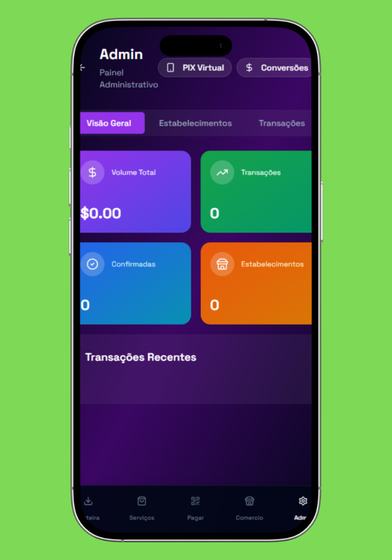

# CryptoPay

A fullstack crypto payments application focused on mobile-first UX, checkout flow, admin operations, and portfolio-ready presentation.


## Project Overview

CryptoPay simulates a modern crypto payment platform with:

- Multi-asset wallet (USDT, BTC, ETH, BNB)
- Send/receive flows with QR support
- Services and gift cards marketplace
- Checkout flow with fee breakdown
- Admin dashboard for operations and analytics

> This project runs in demo mode by default, so reviewers can test the full UX without real payment credentials.

### Demo Mode (Technical Notes)

- Demo mode is controlled by the `DEMO_MODE` flag in `src/react-app/utils/demoMode.ts`.
- Current default is `true`, which enables mocked balances, fake transaction hashes, simulated delays, and synthetic voucher generation.
- This keeps the app fully testable without requiring real wallets, payment providers, or production secrets.
- To switch to real integrations later, set `DEMO_MODE` to `false` and wire real API/Web3 credentials via environment variables.

## Demo Video

<video src="./screenshots/demo.mp4" width="320" controls></video>

- [Watch demo video (MP4)](./screenshots/demo.mp4)

## Required Screenshots

### 01 - Wallet with balance


### 02 - Marketplace services


### 03 - Checkout / QR Code


### 04 - Admin Dashboard


## 🧠 Vision

CryptoPay is designed as a foundation for a **Web3 payment infrastructure**, similar to Stripe — enabling seamless crypto transactions for digital services, marketplaces, and online platforms.

---

## 🛠 Tech Stack

### Frontend
- React 19
- TypeScript
- Vite
- Tailwind CSS
- Recharts

### Backend
- Hono
- Cloudflare Workers
- Cloudflare D1

### Web3 & Utilities
- wagmi
- viem
- RainbowKit
- QRCode

## Local Setup

### Prerequisites
- Node.js 20+
- npm

### Install and run

```bash
git clone https://github.com/your-username/cryptopay.git
cd cryptopay
npm install
cp .env.example .env
npm run dev
```

For Windows PowerShell, replace `cp` with:

```powershell
Copy-Item .env.example .env
```

### Cloudflare D1 local migrations

After installing dependencies, apply local D1 migrations:

```bash
npx wrangler d1 migrations apply cryptopay-db --local
```

If your local DB name is different, replace `cryptopay-db` with your configured D1 database name.

## Useful Scripts

- `npm run dev` -> start development server
- `npm run lint` -> run lint checks
- `npm run build` -> production build
- `npm run preview` -> preview production build locally
- `npm run check` -> typecheck + build verification

## Suggested Review Flow

1. Open wallet and validate balances/actions.
2. Open Services and browse categories.
3. Run a checkout/QR payment flow.
4. Open Admin and inspect dashboard tabs.
5. Validate responsive mobile navigation.

## Repository Structure

```text
cryptopay/
├─ screenshots/        # README screenshots and demo video
├─ src/react-app/      # frontend
├─ src/worker/         # API worker (Hono + Cloudflare)
├─ migrations/         # database schema and evolutions
├─ public/             # static public assets
└─ docs/               # project notes
```

## Status

- Lint: passing
- Build: passing
- Ready for public GitHub portfolio

## License

Portfolio and educational use.
